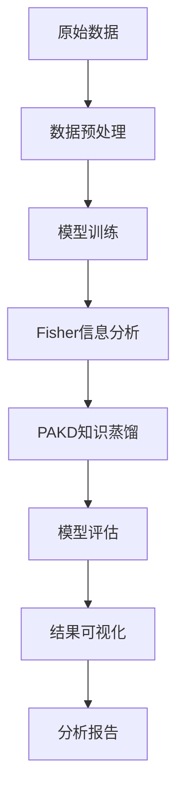

# 🚀 Online Inference System - 代码功能总览

## 📖 概述

本文档提供了在线推荐系统项目的所有核心代码组件的详细功能和目的说明。该系统集成了传统推荐算法、大语言模型（LLM）、Fisher信息分析、知识蒸馏、模型剪枝等前沿技术，构建了一个完整的推荐系统实验平台。

---

## 🏗️ 核心架构模块

### 📊 Models（模型层）
位置：`models/`

| 文件 | 功能 | 用途 |
|------|------|------|
| `base_recommender.py` | 基础推荐器抽象类 | 定义所有推荐模型的统一接口 |
| `algorithm_factory.py` | 算法工厂模式 | 动态创建和管理不同的推荐算法实例 |
| `ensemble_recommender.py` | **集成推荐器** | **⭐ 主要使用：SVD+xDeepFM+AutoInt三算法集成** |
| `deepfm.py` | DeepFM模型 | 深度因子分解机 |
| `autoint.py` | AutoInt模型 | 自动特征交互模型 |
| `dcnv2.py` | DCNv2模型 | 深度交叉网络v2 |
| `xdeepfm.py` | xDeepFM模型 | 极深因子分解机 |
| `din.py` | DIN模型 | 深度兴趣网络 |
| `transformer4rec.py` | Transformer4Rec | 基于Transformer的推荐模型 |
| `lightfm_model.py` | LightFM模型 | 轻量级因子分解机 |
| `svd_model.py` | SVD模型 | 奇异值分解推荐模型 |
| `faiss_index.py` | FAISS索引 | 高效相似性搜索和聚类 |

### 🧠 Teachers（教师模型）
位置：`teachers/`

#### Fisher Utils（Fisher信息工具集）
位置：`teachers/fisher_utils/`

| 文件 | 功能 | 用途 |
|------|------|------|
| `complete_demo.py` | **完整演示脚本** | 展示Fisher信息计算和可视化的端到端流程 |
| `ensemble_fisher_calculator.py` | **集成Fisher信息计算器** | 计算集成模型的Fisher信息矩阵，分析模型重要性 |
| `movielens_fisher_experiment.py` | **MovieLens Fisher实验** | 在MovieLens数据集上进行Fisher信息分析实验 |
| `ensemble_pakd.py` | **集成PAKD蒸馏器** | 基于Fisher信息的剪枝感知知识蒸馏 |

#### LLM Teachers（大语言模型教师）
位置：`teachers/llm_teachers/`

| 文件 | 功能 | 用途 |
|------|------|------|
| `real_movielens_llm_recommender.py` | **真实数据LLM推荐器** | 在真实MovieLens数据上运行LLM推荐 |
| `llm_pakd_distiller.py` | **LLM PAKD蒸馏器** | LLM模型的剪枝感知知识蒸馏 |
| `complete_llm_real_data_experiment.py` | **完整LLM真实数据实验** | 综合LLM推荐、Fisher分析、PAKD蒸馏的完整实验 |

### 📊 Evaluation（评估模块）
位置：`evaluation/`

| 文件 | 功能 | 用途 |
|------|------|------|
| `complete_evaluation.py` | **完整评估脚本** | 运行所有推荐模型的综合性能评估 |
| `fixed_complete_evaluation.py` | **修复版完整评估** | 修复了bug的完整评估脚本 |
| `metrics.py` | 评估指标计算 | 实现RMSE、MAE、精度、召回率等指标 |
| `consistency_analysis.py` | 一致性分析 | 分析模型预测的一致性 |
| `consistency_experiment.py` | 一致性实验 | 运行模型一致性实验 |
| `run_evaluation.py` | 评估运行器 | 通用评估任务运行接口 |

### 🧪 Layerwise Adapter（分层适配器）
位置：`layerwise_adapter/experiments/`

| 文件 | 功能 | 用途 |
|------|------|------|
| `real_data_experiment.py` | **真实数据实验管理器** | 管理在真实数据集上的分层适配实验 |

### 📈 可视化与分析

| 文件 | 功能 | 用途 |
|------|------|------|
| `visualize_llm_results.py` | **LLM结果可视化** | 生成LLM实验结果的图表和分析报告 |

### 🔧 Services（服务层）
位置：`services/`

| 文件 | 功能 | 用途 |
|------|------|------|
| `recommendation.py` | 推荐服务核心 | 实现推荐API的业务逻辑 |
| `ab_testing.py` | A/B测试服务 | 支持模型对比和在线实验 |
| `cache.py` | 缓存服务 | 提供Redis和内存缓存支持 |
| `explainability.py` | 可解释性服务 | 生成推荐结果的解释 |
| `multi_objective.py` | 多目标优化 | 处理多目标推荐场景 |

### 🛠️ Utils（工具层）
位置：`utils/`

| 文件 | 功能 | 用途 |
|------|------|------|
| `data_loader.py` | 数据加载器 | 统一的数据加载和预处理接口 |

---

## 🎯 核心实验流程

### 1. 传统模型实验
```bash
# 运行完整评估
python evaluation/complete_evaluation.py
# 或使用修复版本
python evaluation/fixed_complete_evaluation.py
```

### 2. Fisher信息分析实验
```bash
# 完整Fisher演示
python teachers/fisher_utils/complete_demo.py

# MovieLens Fisher实验
python teachers/fisher_utils/movielens_fisher_experiment.py

# 集成PAKD实验
python teachers/fisher_utils/ensemble_pakd.py
```

### 3. LLM推荐实验
```bash
# 真实数据LLM推荐
python teachers/llm_teachers/real_movielens_llm_recommender.py

# 完整LLM实验（推荐+Fisher+PAKD）
python teachers/llm_teachers/complete_llm_real_data_experiment.py
```

### 4. 分层适配实验
```bash
# 真实数据分层适配实验
python layerwise_adapter/experiments/real_data_experiment.py
```

### 5. 结果可视化
```bash
# 生成LLM实验可视化
python visualize_llm_results.py
```

---

## 📂 输出目录结构

### `analysis_unified/` - 统一分析结果
- Fisher信息分析结果
- 模型重要性分析
- 剪枝建议报告

### `evaluation/results/` - 评估结果
- 模型性能指标
- 对比分析报告
- 日志文件

### `evaluation/experiments/` - 实验结果
- LLM推荐实验结果
- 分层适配实验结果  
- 可视化图表和报告

---

## 🔄 数据流程



---

## 🚀 快速开始指南

### 1. 环境准备
```bash
pip install -r requirements.txt
```

### 2. 数据准备
```bash
python download_amazon_data.py
```

### 3. 运行核心实验
```bash
# 传统模型评估
python evaluation/complete_evaluation.py

# Fisher分析演示
python teachers/fisher_utils/complete_demo.py

# LLM完整实验
python teachers/llm_teachers/complete_llm_real_data_experiment.py
```

### 4. 查看结果
- 分析结果：`analysis_unified/`
- 评估结果：`evaluation/results/`
- 实验结果：`evaluation/experiments/`

---

## 📊 技术特色

### 🔬 创新技术栈
- **Fisher信息矩阵**：用于模型重要性分析和剪枝指导
- **PAKD（Pruning-Aware Knowledge Distillation）**：剪枝感知的知识蒸馏
- **LLM推荐**：大语言模型在推荐系统中的应用
- **集成学习**：多模型集成优化
- **分层适配**：细粒度的模型适配和优化

### 🎯 核心优势
1. **理论与实践结合**：从Fisher信息理论到实际应用
2. **完整实验流程**：从数据处理到结果分析的全链路
3. **多技术融合**：传统ML、深度学习、LLM的有机结合
4. **可扩展架构**：易于添加新模型和实验
5. **详细文档**：完善的代码文档和实验报告

---

## 📚 相关文档

- [项目架构文档](ARCHITECTURE.md)
- [API使用指南](docs/api.md) 
- [使用样例](examples/API_USAGE_EXAMPLES.md)
- [完整教师模型分析](COMPLETE_TEACHER_MODEL_ANALYSIS.md)
- [项目清单](PROJECT_MANIFEST.json)

---

## 🎉 总结

本系统为推荐算法研究提供了一个完整的实验平台，集成了从传统协同过滤到前沿LLM推荐的各种技术。通过Fisher信息分析、PAKD知识蒸馏等创新方法，实现了模型压缩和性能优化的有机结合。

每个代码文件都有明确的功能定位和输出路径，便于研究人员进行复现和扩展。系统支持多种数据集、多种评估指标，并提供了丰富的可视化和分析工具。
