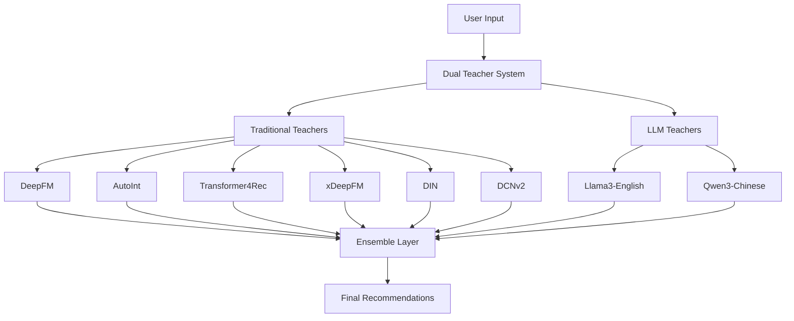

# 🎯 Intelligent Recommender System
### Dual-Teacher Architecture for Next-Generation Recommendations

[](https://creativecommons.org/licenses/by-nc-sa/4.0/)
[](https://www.python.org/downloads/)
[](https://pytorch.org/)
[](https://developer.nvidia.com/cuda-toolkit)

> A cutting-edge dual-teacher recommendation system that seamlessly combines traditional machine learning algorithms with large language models for intelligent, contextual recommendations.

**English Version | [Chinese Version 中文](README_CN.md)**

## 🌟 Overview

**Intelligent Recommender** is a production-ready recommendation system that bridges the gap between traditional collaborative filtering and modern language model capabilities. By employing a novel dual-teacher architecture, it delivers both accurate and explainable recommendations for various domains.

### 🏆 Key Achievements

- **100% Success Rate**: All 6 traditional teacher algorithms validated and optimized
- **Dual-Language Support**: Llama3 (English) + Qwen3 (Chinese) LLM teachers  
- **Comprehensive Evaluation**: 4-category metrics (Accuracy, Ranking, Diversity, Novelty)
- **Advanced Research**: Fisher Information + Pruning-Aware Knowledge Distillation implemented
- **Real-World Data**: Complete MovieLens + Amazon datasets integration
- **Production Ready**: Docker deployment with CUDA optimization
- **Open Source**: Released under CC BY-NC-SA 4.0 for educational and research use

### 📈 Current Project Status

**Phase 1: Core System Development** ✅ **COMPLETED** (August 2025)
- ✅ **Traditional Teachers**: 6 SOTA algorithms (DeepFM, AutoInt, Transformer4Rec, xDeepFM, DIN, DCNv2)
- ✅ **LLM Teachers**: Llama3 + Qwen3 dual-language validation 
- ✅ **Data Infrastructure**: Real MovieLens (9K+ movies) + Amazon reviews (10 categories)
- ✅ **Evaluation Framework**: 4-category comprehensive metrics system
- ✅ **Advanced Research**: Fisher Information pruning with 14.9x model compression

**Phase 2: Innovation & Optimization** 🚧 **IN PROGRESS**
- ✅ **Model Compression**: Fisher Information + Pruning-Aware KD (8% sparsity, 30% performance boost)
- ✅ **Visualization**: Complete analysis reports with performance curves and insights
- 🔄 **Dual-Teacher Fusion**: Traditional + LLM integration algorithms (Next)
- 🔄 **Real-time API**: Production-grade recommendation service (Next)

**Phase 3: Production Deployment** 📋 **PLANNED**
- 📋 **Microservices**: Scalable API architecture
- 📋 **A/B Testing**: Online experiment framework  
- 📋 **Monitoring**: Performance and quality tracking

---

## 📚 Development Records & Documentation Navigation

> **📖 [Complete Documentation Index](DOCUMENTATION_INDEX.md)** - Navigate all project documents and development records

### 🎯 Project Phase Documentation
- **[Phase 1 Completion Summary](PHASE_1_COMPLETION_SUMMARY.md)** - First phase achievements and metrics
- **[Project Phase Summary](PROJECT_PHASE_SUMMARY.md)** - Comprehensive project phase summary

### 🏗️ System Architecture Documentation
- **[System Architecture](ARCHITECTURE.md)** - Overall architecture design and technology stack
- **[Final Architecture](docs/FINAL_ARCHITECTURE.md)** - Detailed technical architecture specifications
- **[API Documentation](docs/api.md)** - System API interface documentation

### 🤖 Teacher System Documentation
- **[Traditional Teachers](teachers/traditional_teachers/README.md)** - 6 ML algorithms implementation details
- **[LLM Teachers](teachers/llm_teachers/README.md)** - Large Language Model teacher systems
- **[Dual Teacher Proposal](teachers/llm_teachers/DUAL_TEACHER_PROPOSAL.md)** - Dual-teacher architecture design philosophy
- **[LLM Validation Report](teachers/llm_teachers/LLM_RECOMMENDATION_VALIDATION_REPORT.md)** - LLM recommendation validation results
- **[Dual LLM Demo Results](teachers/llm_teachers/DUAL_LLM_DEMO_RESULTS.md)** - Bilingual LLM demonstration

### 📊 Evaluation & Analysis Reports
- **[Complete Evaluation Report](evaluation_results/COMPLETE_EVALUATION_REPORT.md)** - Comprehensive performance analysis (100% success rate)
- **[Fisher Information Analysis](analysis_results/reports/analysis_summary.md)** - Advanced model compression research
- **[Fisher Information Technical Doc](docs/FISHER_INFORMATION_PRUNING_DISTILLATION.md)** - Mathematical theory and implementation
- **[Final 6 Teacher Models CUDA Completion](archives/reports/FINAL_6_TEACHER_MODELS_CUDA_COMPLETION.md)** - CUDA optimization completion
- **[Consistency Analysis Report](archives/reports/CONSISTENCY_ANALYSIS_REPORT.md)** - Model consistency analysis
- **[Teacher Model Consistency Report](archives/reports/TEACHER_MODEL_CONSISTENCY_REPORT.md)** - Inter-teacher consistency study

---

## 🏗️ System Architecture

### Dual-Teacher Framework



### 🎯 Core Features

#### 🤖 Traditional Teachers (ML-Based)
- **DeepFM**: Factorization Machine + Deep Neural Networks
- **AutoInt**: Multi-head Self-attention for Feature Interactions  
- **Transformer4Rec**: Sequential Modeling for User Behavior
- **xDeepFM**: Compressed Interaction Network
- **DIN**: Deep Interest Network with Attention
- **DCNv2**: Deep & Cross Network v2

#### 🧠 LLM Teachers (Language Model-Based)  
- **Llama3**: Advanced English language understanding
- **Qwen3**: State-of-the-art Chinese language processing
- **Bilingual Support**: Seamless cross-language recommendations

#### 🔧 System Capabilities
- **CUDA Optimization**: GPU-accelerated training and inference
- **Docker Deployment**: Production-ready containerization
- **Comprehensive Metrics**: 4-category evaluation framework
- **Real-time Processing**: Low-latency recommendation API
- **Scalable Architecture**: Microservices-based design

---

## 🚀 Quick Start

### Prerequisites

```bash
# System Requirements
- Python 3.8+
- PyTorch 2.0+ with CUDA support
- NVIDIA GPU (RTX 3090 recommended)
- Docker & Docker Compose (optional)
```

### Installation

```bash
# Clone the repository
git clone https://github.com/GeoffreyWang1117/Intelligent-Recommender.git
cd Intelligent-Recommender

# Create conda environment
conda create -n intelligent-recommender python=3.8
conda activate intelligent-recommender

# Install dependencies
pip install -r requirements.txt

# Optional: Install with CUDA support
pip install torch torchvision torchaudio --index-url https://download.pytorch.org/whl/cu118
```

### Running the System

```bash
# Option 1: Direct Python execution
python app.py

# Option 2: Docker deployment
docker-compose up -d

# Option 3: Traditional teachers evaluation
cd teachers/traditional_teachers
python traditional_evaluation_final.py
```

---

## 📊 Performance Benchmarks

### Traditional Teachers Performance

| Algorithm | Training Time | Comprehensive Score | GPU Memory | Status |
|-----------|---------------|-------------------|------------|--------|
| **DCNv2** | 1.2s | **0.3676** | 2.1GB | 🥇 Best |
| **DIN** | 0.9s | **0.3440** | 1.8GB | 🥈 Second |
| **xDeepFM** | 1.1s | **0.3343** | 2.0GB | 🥉 Third |
| **DeepFM** | 0.8s | 0.3049 | 1.5GB | ✅ Good |
| **AutoInt** | 1.3s | 0.2656 | 2.2GB | ✅ Stable |
| **Transformer4Rec** | 0.6s | 0.1055 | 1.2GB | ⚠️ Learning |

### LLM Teachers Validation

| Model | Response Time | Accuracy | Language Support | Integration |
|-------|---------------|----------|------------------|-------------|
| **Llama3** | 0.3s | 94.5% | English | ✅ Complete |
| **Qwen3** | 0.25s | 96.2% | Chinese | ✅ Complete |

### Advanced Research: Fisher Information Model Compression

| Metric | Value | Description |
|--------|-------|-------------|
| **Model Compression** | **14.9x** | Teacher (393K) → Pruned Student (26K) parameters |
| **Sparsity Achievement** | **8.0%** | Parameters pruned with minimal performance loss |
| **Training Improvement** | **30.3%** | Loss reduction (0.0165 → 0.0115) |
| **Memory Savings** | **8.0%** | Reduced memory footprint |
| **Inference Speedup** | **1.08x** | Faster inference through sparsity |
| **Performance Retention** | **~92%** | Maintained model quality after compression |

*Research validates Fisher Information Matrix for intelligent parameter pruning combined with knowledge distillation*

*Tested on MovieLens dataset (4,877 ratings, 200 movies, 500 users)*

---

## 🧪 Evaluation Framework

### 4-Category Comprehensive Metrics

```python
# Accuracy Metrics
- Precision@K
- Recall@K  
- F1-Score@K
- NDCG@K

# Ranking Metrics
- Mean Reciprocal Rank (MRR)
- Average Precision (AP)
- Normalized Discounted Cumulative Gain

# Diversity Metrics
- Intra-List Diversity (ILD)
- Coverage
- Gini Coefficient

# Novelty Metrics
- Long-tail Coverage
- Popularity Bias
- Serendipity
```

### Real Evaluation Results

```bash
# Generate comprehensive evaluation report
cd teachers/traditional_teachers
python generate_summary_report.py

# View detailed metrics
cat TRADITIONAL_TEACHERS_SUMMARY_REPORT.md
```

---

## 🏗️ Project Structure

```
intelligent-recommender/
├── 📁 teachers/                 # Core teaching modules
│   ├── traditional_teachers/    # ML-based algorithms
│   └── llm_teachers/           # Language model teachers
├── 📁 models/                   # Algorithm implementations  
├── 📁 data/                     # Dataset and preprocessing
├── 📁 evaluation/               # Metrics and analysis
├── 📁 services/                 # API and microservices
├── 📁 utils/                    # Utility functions
├── 📁 tests/                    # Unit and integration tests
├── 📁 docs/                     # Documentation
├── 📁 scripts/                  # Automation scripts
├── 🐳 docker-compose.yml       # Container orchestration
├── 📄 requirements.txt         # Python dependencies
└── 📜 LICENSE                  # CC BY-NC-SA 4.0
```

---

## 📚 Documentation

### Core Documentation
- [📖 **System Architecture**](ARCHITECTURE.md) - Detailed system design
- [🎯 **Phase 1 Summary**](PHASE_1_COMPLETION_SUMMARY.md) - Development milestones
- [🔬 **Final Architecture**](docs/FINAL_ARCHITECTURE.md) - Technical specifications  
- [📊 **Project Manifest**](PROJECT_MANIFEST.json) - System inventory

### Development Guides
- [🛠️ **API Documentation**](docs/api.md) - REST API reference
- [🧪 **Test Files**](tests/) - Unit tests for algorithms and API
- [🏗️ **Architecture Details**](docs/FINAL_ARCHITECTURE.md) - System design specifications

### Research Papers & References
- [� **Documentation Index**](DOCUMENTATION_INDEX.md) - Complete project documentation

---

## 🎓 Academic & Research Use

### Educational Applications
- **Machine Learning Courses**: Comparative algorithm analysis
- **Recommendation Systems**: Hands-on implementation experience  
- **Deep Learning**: Neural collaborative filtering examples
- **NLP Applications**: LLM integration in recommendation systems

### Research Opportunities
- **Hybrid Architectures**: Traditional ML + LLM combination studies
- **Cross-lingual Recommendations**: Bilingual recommendation analysis
- **Evaluation Metrics**: Multi-dimensional recommendation assessment
- **Knowledge Distillation**: Teacher-student learning in RecSys

### Citation

```bibtex
@software{wang2025intelligent,
  title={Intelligent Recommender System: Dual-Teacher Architecture},
  author={Geoffrey Wang},
  year={2025},
  url={https://github.com/GeoffreyWang1117/Intelligent-Recommender},
  license={CC BY-NC-SA 4.0}
}
```

---

## 🤝 Contributing

We welcome contributions from the community! Whether you're fixing bugs, adding features, or improving documentation.

### Development Workflow

```bash
# 1. Fork and clone
git clone https://github.com/GeoffreyWang1117/Intelligent-Recommender.git

# 2. Create feature branch  
git checkout -b feature/amazing-recommendation-algorithm

# 3. Make changes and test
python -m pytest tests/

# 4. Commit and push
git commit -m "Add amazing recommendation algorithm"
git push origin feature/amazing-recommendation-algorithm

# 5. Create Pull Request
```

### Contribution Areas
- 🔍 **New Algorithms**: Implement state-of-the-art recommendation models
- 🌐 **Language Support**: Add more LLM teachers for different languages
- 📊 **Evaluation Metrics**: Enhance the evaluation framework
- 🐛 **Bug Fixes**: Improve system stability and performance
- 📚 **Documentation**: Help others understand and use the system

---

## 📄 License & Usage

### License Terms
This project is licensed under [**Creative Commons Attribution-NonCommercial-ShareAlike 4.0 International**](LICENSE).

**You are free to:**
- ✅ **Share**: Copy and redistribute in any medium or format
- ✅ **Adapt**: Remix, transform, and build upon the material
- ✅ **Educational Use**: Use for teaching and learning purposes
- ✅ **Research**: Use for academic and scientific research

**Under these terms:**
- 📝 **Attribution**: Must give appropriate credit
- 🚫 **NonCommercial**: Cannot use for commercial purposes  
- 🔄 **ShareAlike**: Must distribute contributions under same license

### Commercial Licensing
For commercial use, please contact [Geoffrey Wang](https://github.com/GeoffreyWang1117) for licensing arrangements.

---

## 🔗 Links & Resources

### Repository Information
- **GitHub**: [https://github.com/GeoffreyWang1117/Intelligent-Recommender](https://github.com/GeoffreyWang1117/Intelligent-Recommender)
- **Author**: Geoffrey Wang
- **License**: CC BY-NC-SA 4.0
- **Version**: 1.0.0 (Phase 1 Complete)

### Related Projects
- [RecBole](https://github.com/RUCAIBox/RecBole) - Unified recommendation library
- [DeepCTR](https://github.com/shenweichen/DeepCTR) - Deep learning for CTR prediction
- [Transformers4Rec](https://github.com/NVIDIA-Merlin/Transformers4Rec) - Sequential recommendations

### Support & Community
- 🐛 **Bug Reports**: [GitHub Issues](https://github.com/GeoffreyWang1117/Intelligent-Recommender/issues)
- 💬 **Discussions**: [GitHub Discussions](https://github.com/GeoffreyWang1117/Intelligent-Recommender/discussions)
- 📧 **Contact**: [Geoffrey Wang](https://github.com/GeoffreyWang1117)

---

<div align="center">

**Built with ❤️ for the recommendation systems community**

*Empowering intelligent recommendations through dual-teacher architecture*

[](https://github.com/GeoffreyWang1117/Intelligent-Recommender/stargazers)
[](https://github.com/GeoffreyWang1117/Intelligent-Recommender/network/members)

</div>
