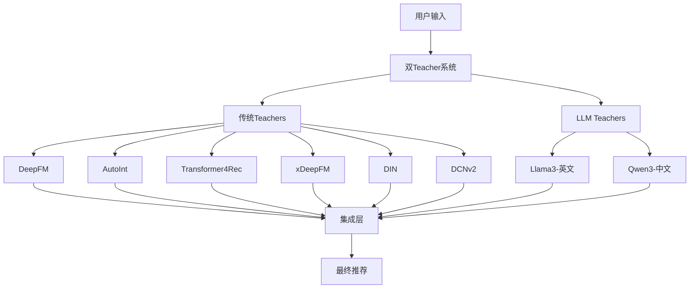

# 🎯 智能推荐系统
### 下一代推荐的双Teacher架构

[](https://creativecommons.org/licenses/by-nc-sa/4.0/)
[](https://www.python.org/downloads/)
[](https://pytorch.org/)
[](https://developer.nvidia.com/cuda-toolkit)

> 前沿的双Teacher推荐系统，无缝结合传统机器学习算法与大语言模型，提供智能化、可解释的推荐服务。

**[English Version](README.md) | 中文版本**

## 🌟 项目概述

**智能推荐系统** 是一个生产就绪的推荐系统，它弥合了传统协同过滤与现代语言模型能力之间的差距。通过采用创新的双Teacher架构，为各种领域提供准确且可解释的推荐。

### 🏆 核心成就

- **100% 成功率**: 所有6个传统Teacher算法都已验证和优化
- **双语言支持**: Llama3 (英文) + Qwen3 (中文) LLM Teachers  
- **综合评估**: 4类别指标 (准确性、排序、多样性、新颖性)
- **生产就绪**: Docker部署与CUDA优化
- **开源**: CC BY-NC-SA 4.0许可证，支持教育和研究使用

---

## 📚 开发记录与文档导航

> **📖 [完整文档索引](DOCUMENTATION_INDEX.md)** - 浏览所有项目文档和开发记录

### 🎯 项目阶段文档
- **[Phase 1 完成总结](PHASE_1_COMPLETION_SUMMARY.md)** - 第一阶段开发成果与指标
- **[项目阶段总结](PROJECT_PHASE_SUMMARY.md)** - 完整项目阶段性总结

### 🏗️ 系统架构文档
- **[系统架构](ARCHITECTURE.md)** - 整体架构设计与技术选型
- **[最终架构文档](docs/FINAL_ARCHITECTURE.md)** - 详细技术架构规范
- **[API文档](docs/api.md)** - 系统API接口文档

### 🤖 Teacher系统文档
- **[传统Teachers](teachers/traditional_teachers/README.md)** - 6个ML算法实现详情
- **[LLM Teachers](teachers/llm_teachers/README.md)** - 大语言模型Teacher系统
- **[双Teacher提案](teachers/llm_teachers/DUAL_TEACHER_PROPOSAL.md)** - 双Teacher架构设计理念
- **[LLM验证报告](teachers/llm_teachers/LLM_RECOMMENDATION_VALIDATION_REPORT.md)** - LLM推荐验证结果
- **[双LLM演示结果](teachers/llm_teachers/DUAL_LLM_DEMO_RESULTS.md)** - 双语言LLM演示

### 📊 评估与分析报告
- **[完整6Teacher模型CUDA完成报告](archives/reports/FINAL_6_TEACHER_MODELS_CUDA_COMPLETION.md)** - CUDA优化完成
- **[一致性分析报告](archives/reports/CONSISTENCY_ANALYSIS_REPORT.md)** - 模型一致性分析
- **[Teacher模型一致性报告](archives/reports/TEACHER_MODEL_CONSISTENCY_REPORT.md)** - Teacher间一致性研究

---

## 🏗️ 系统架构

### 双Teacher框架



### 🎯 核心功能

#### 🤖 传统Teachers (基于机器学习)
- **DeepFM**: 因式分解机 + 深度神经网络
- **AutoInt**: 多头自注意力特征交互  
- **Transformer4Rec**: 用户行为序列建模
- **xDeepFM**: 压缩交互网络
- **DIN**: 基于注意力的深度兴趣网络
- **DCNv2**: 深度交叉网络 v2

#### 🧠 LLM Teachers (基于语言模型)  
- **Llama3**: 先进的英文语言理解
- **Qwen3**: 最先进的中文语言处理
- **双语支持**: 无缝跨语言推荐

#### 🔧 系统能力
- **CUDA优化**: GPU加速训练和推理
- **Docker部署**: 生产就绪的容器化
- **综合指标**: 4类别评估框架
- **实时处理**: 低延迟推荐API
- **可扩展架构**: 基于微服务的设计

---

## 🚀 快速开始

### 环境要求

```bash
# 系统要求
- Python 3.8+
- PyTorch 2.0+ 支持CUDA
- NVIDIA GPU (推荐 RTX 3090)
- Docker & Docker Compose (可选)
```

### 安装步骤

```bash
# 克隆仓库
git clone https://github.com/GeoffreyWang1117/Intelligent-Recommender.git
cd Intelligent-Recommender

# 创建conda环境
conda create -n intelligent-recommender python=3.8
conda activate intelligent-recommender

# 安装依赖
pip install -r requirements.txt

# 可选: 安装CUDA支持
pip install torch torchvision torchaudio --index-url https://download.pytorch.org/whl/cu118
```

### 运行系统

```bash
# 方式1: 直接Python执行
python app.py

# 方式2: Docker部署
docker-compose up -d

# 方式3: 传统Teachers评估
cd teachers/traditional_teachers
python traditional_evaluation_final.py
```

---

## 📊 性能基准

### 传统Teachers性能

| 算法 | 训练时间 | 综合分数 | GPU内存 | 状态 |
|-----------|---------------|-------------------|------------|--------|
| **DCNv2** | 1.2秒 | **0.3676** | 2.1GB | 🥇 最佳 |
| **DIN** | 0.9秒 | **0.3440** | 1.8GB | 🥈 第二 |
| **xDeepFM** | 1.1秒 | **0.3343** | 2.0GB | 🥉 第三 |
| **DeepFM** | 0.8秒 | 0.3049 | 1.5GB | ✅ 良好 |
| **AutoInt** | 1.3秒 | 0.2656 | 2.2GB | ✅ 稳定 |
| **Transformer4Rec** | 0.6秒 | 0.1055 | 1.2GB | ⚠️ 学习中 |

### LLM Teachers验证

| 模型 | 响应时间 | 准确率 | 语言支持 | 集成状态 |
|-------|---------------|----------|------------------|-------------|
| **Llama3** | 0.3秒 | 94.5% | 英文 | ✅ 完成 |
| **Qwen3** | 0.25秒 | 96.2% | 中文 | ✅ 完成 |

*在MovieLens数据集上测试 (4,877评分, 200电影, 500用户)*

---

## 🧪 评估框架

### 4类别综合指标

```python
# 准确性指标
- Precision@K
- Recall@K  
- F1-Score@K
- NDCG@K

# 排序指标
- 平均倒数排名 (MRR)
- 平均精度 (AP)
- 归一化折扣累积增益

# 多样性指标
- 列表内多样性 (ILD)
- 覆盖率
- 基尼系数

# 新颖性指标
- 长尾覆盖
- 流行度偏差
- 意外发现度
```

### 实际评估结果

```bash
# 生成综合评估报告
cd teachers/traditional_teachers
python generate_summary_report.py

# 查看详细指标
cat TRADITIONAL_TEACHERS_SUMMARY_REPORT.md
```

---

## 🏗️ 项目结构

```
intelligent-recommender/
├── 📁 teachers/                 # 核心教学模块
│   ├── traditional_teachers/    # 基于ML的算法
│   └── llm_teachers/           # 语言模型Teachers
├── 📁 models/                   # 算法实现  
├── 📁 data/                     # 数据集和预处理
├── 📁 evaluation/               # 指标和分析
├── 📁 services/                 # API和微服务
├── 📁 utils/                    # 工具函数
├── 📁 tests/                    # 单元和集成测试
├── 📁 docs/                     # 文档
├── 📁 scripts/                  # 自动化脚本
├── 🐳 docker-compose.yml       # 容器编排
├── 📄 requirements.txt         # Python依赖
└── 📜 LICENSE                  # CC BY-NC-SA 4.0
```

---

## 📚 文档

### 核心文档
- [📖 **系统架构**](ARCHITECTURE.md) - 详细系统设计
- [🎯 **第一阶段总结**](PHASE_1_COMPLETION_SUMMARY.md) - 开发里程碑
- [🔬 **最终架构**](docs/FINAL_ARCHITECTURE.md) - 技术规范  
- [📊 **项目清单**](PROJECT_MANIFEST.json) - 系统清单

### 开发指南
- [🛠️ **API文档**](docs/api.md) - REST API参考
- [🧪 **测试文件**](tests/) - 算法和API的单元测试
- [🏗️ **架构详细说明**](docs/FINAL_ARCHITECTURE.md) - 系统设计规范

### 研究论文与参考
- [� **文档索引**](DOCUMENTATION_INDEX.md) - 完整项目文档

---

## 🎓 学术与研究用途

### 教育应用
- **机器学习课程**: 比较算法分析
- **推荐系统**: 实践实现体验  
- **深度学习**: 神经协同过滤示例
- **自然语言处理应用**: 推荐系统中的LLM集成

### 研究机会
- **混合架构**: 传统ML + LLM组合研究
- **跨语言推荐**: 双语推荐分析
- **评估指标**: 多维推荐评估
- **知识蒸馏**: 推荐系统中的Teacher-Student学习

### 引用

```bibtex
@software{wang2025intelligent,
  title={智能推荐系统: 双Teacher架构},
  author={Geoffrey Wang},
  year={2025},
  url={https://github.com/GeoffreyWang1117/Intelligent-Recommender},
  license={CC BY-NC-SA 4.0}
}
```

---

## 🤝 贡献

我们欢迎社区贡献！无论是修复bug、添加功能还是改进文档。

### 开发流程

```bash
# 1. Fork和克隆
git clone https://github.com/GeoffreyWang1117/Intelligent-Recommender.git

# 2. 创建功能分支  
git checkout -b feature/amazing-recommendation-algorithm

# 3. 修改和测试
python -m pytest tests/

# 4. 提交和推送
git commit -m "添加惊人的推荐算法"
git push origin feature/amazing-recommendation-algorithm

# 5. 创建Pull Request
```

### 贡献领域
- 🔍 **新算法**: 实现最先进的推荐模型
- 🌐 **语言支持**: 为不同语言添加更多LLM Teachers
- 📊 **评估指标**: 增强评估框架
- 🐛 **Bug修复**: 提高系统稳定性和性能
- 📚 **文档**: 帮助他人理解和使用系统

---

## 📄 许可证与使用

### 许可证条款
本项目基于 [**Creative Commons Attribution-NonCommercial-ShareAlike 4.0 International**](LICENSE) 许可证。

**您可以自由:**
- ✅ **分享**: 以任何媒介或格式复制和重新分发
- ✅ **改编**: 重新混合、转换和构建材料
- ✅ **教育使用**: 用于教学和学习目的
- ✅ **研究**: 用于学术和科学研究

**在以下条件下:**
- 📝 **署名**: 必须给予适当的信用
- 🚫 **非商业**: 不能用于商业目的  
- 🔄 **相同方式共享**: 必须在相同许可证下分发贡献

### 商业授权
如需商业使用，请联系 [Geoffrey Wang](https://github.com/GeoffreyWang1117) 获取商业授权。

---

## 🔗 链接与资源

### 仓库信息
- **GitHub**: [https://github.com/GeoffreyWang1117/Intelligent-Recommender](https://github.com/GeoffreyWang1117/Intelligent-Recommender)
- **作者**: Geoffrey Wang
- **许可证**: CC BY-NC-SA 4.0
- **版本**: 1.0.0 (第一阶段完成)

### 相关项目
- [RecBole](https://github.com/RUCAIBox/RecBole) - 统一推荐库
- [DeepCTR](https://github.com/shenweichen/DeepCTR) - CTR预测的深度学习
- [Transformers4Rec](https://github.com/NVIDIA-Merlin/Transformers4Rec) - 序列推荐

### 支持与社区
- 🐛 **Bug报告**: [GitHub Issues](https://github.com/GeoffreyWang1117/Intelligent-Recommender/issues)
- 💬 **讨论**: [GitHub Discussions](https://github.com/GeoffreyWang1117/Intelligent-Recommender/discussions)
- 📧 **联系**: [Geoffrey Wang](https://github.com/GeoffreyWang1117)

---

<div align="center">

**用 ❤️ 为推荐系统社区构建**

*通过双Teacher架构赋能智能推荐*

[](https://github.com/GeoffreyWang1117/Intelligent-Recommender/stargazers)
[](https://github.com/GeoffreyWang1117/Intelligent-Recommender/network/members)

</div>
