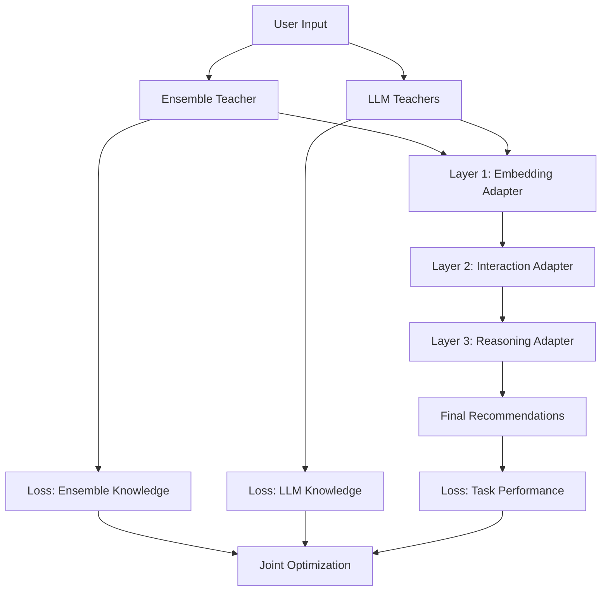

# 🏗️ LLM Layerwise Adapter Architecture
*Dual-Teacher Knowledge Distillation for Lightweight Recommendation*

## 📋 项目概述

### 🎯 核心目标
构建一个小型多层Transformer，通过层级适配器学习从两种Teacher（Ensemble + LLM）到轻量级Student的知识转移，实现：
- **性能目标**: 保持90%+推荐质量
- **效率目标**: 延迟从7秒降至<100ms  
- **压缩目标**: 模型大小压缩1000倍

### 🧮 理论基础

#### 多Teacher知识融合
$$L_{adapter} = \alpha L_{ensemble}(T_e, S) + \beta L_{llm}(T_{llm}, S) + \gamma L_{task}(S, y)$$

其中：
- $T_e$: Ensemble Teacher (OptimizedEnsembleTeacher)
- $T_{llm}$: LLM Teachers (Llama3 + Qwen3)
- $S$: Student Layerwise Adapter
- $\alpha, \beta, \gamma$: 平衡权重

#### Fisher信息指导的层级设计
基于实验Fisher分析结果：
```
Prompt Embeddings: 7040.4 → Layer 1 (Embedding Adapter)
Response Embeddings: 7008.0 → Layer 2 (Interaction Adapter)  
Recommendation Embeddings: 7035.8 → Layer 3 (Reasoning Adapter)
```

## 🏛️ 系统架构

### 三层Transformer设计

#### Layer 1: Embedding Adapter
```
输入: User ID + Item ID + Context Features
功能: 特征表示学习和融合
Teacher指导: Ensemble嵌入 + LLM语义理解
输出: Unified Embeddings
```

#### Layer 2: Interaction Adapter  
```
输入: Unified Embeddings
功能: 用户-物品交互模式学习
Teacher指导: Ensemble特征交互 + LLM关联推理
输出: Interaction Patterns
```

#### Layer 3: Reasoning Adapter
```
输入: Interaction Patterns
功能: 推荐决策和解释生成
Teacher指导: LLM推理链 + Ensemble评分预测
输出: Recommendations + Explanations
```

### 🔄 Knowledge Distillation Pipeline



## 📁 文件结构

```
layerwise_adapter/
├── models/
│   ├── __init__.py
│   ├── embedding_adapter.py      # Layer 1实现
│   ├── interaction_adapter.py    # Layer 2实现
│   ├── reasoning_adapter.py      # Layer 3实现
│   ├── layerwise_transformer.py  # 完整模型
│   └── multi_teacher_distiller.py # 双Teacher蒸馏
├── experiments/
│   ├── __init__.py
│   ├── training_pipeline.py      # 训练流程
│   ├── evaluation_metrics.py     # 评估指标
│   ├── performance_benchmark.py  # 性能测试
│   └── ablation_study.py         # 消融实验
├── utils/
│   ├── __init__.py
│   ├── data_processing.py        # 数据处理
│   ├── teacher_integration.py    # Teacher模型集成
│   ├── optimization_utils.py     # 优化工具
│   └── visualization.py          # 结果可视化
├── results/
│   └── (实验结果和报告)
├── ARCHITECTURE.md               # 本文件
├── IMPLEMENTATION_PLAN.md        # 实现计划
└── README.md                     # 项目说明
```

## 🎯 实现阶段

### Phase 1: 基础架构 (1-2周)
- [x] 项目结构搭建
- [ ] 核心模型接口设计
- [ ] Teacher模型集成
- [ ] 数据处理pipeline

### Phase 2: 核心实现 (2-3周)  
- [ ] 三层Adapter实现
- [ ] 多Teacher蒸馏算法
- [ ] 联合训练优化
- [ ] 推理优化

### Phase 3: 实验验证 (1-2周)
- [ ] 性能对比实验
- [ ] 效率评估测试
- [ ] 消融研究分析
- [ ] 结果可视化

## 📊 预期成果

### 性能指标
- **推荐质量**: 目标保持90%+原始性能
- **响应速度**: <100ms (vs 7000ms原始)
- **模型大小**: <10MB (vs 10GB+ 原始)
- **内存占用**: <100MB (vs 8GB+ 原始)

### 学术贡献
1. **多Teacher层级蒸馏理论框架**
2. **轻量级推荐系统新范式**  
3. **Fisher信息指导的架构设计**
4. **端到端知识转移机制**

### 工程价值
1. **生产就绪的轻量级推荐引擎**
2. **边缘计算友好的部署方案**
3. **实时推荐系统解决方案**
4. **可扩展的多Teacher框架**

---

*本项目基于完整的Fisher信息分析和PAKD实验基础，旨在构建下一代高效推荐系统。*
